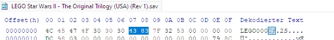
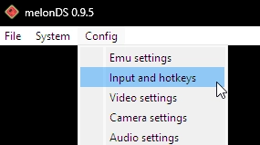

# The Five Rings Minikit in 6-3 "Speeder Chase" Guide
## Introduction
As you probably know, the Nintendo DS version of this game is full of glitches. Some may even say, there are more bugs than actual content.

One of them is easily the most annoying, because it prevents you from completing the game 100%. Yes, that's right – depending on your game version, you may not be able to master it. In that case, flying through all five rings in level 6-3 does not spawn the minikit.

However, with the help of [this post](https://gamefaqs.gamespot.com/boards/931976-lego-star-wars-ii-the-original-trilogy/79045031), I recently discovered a way to actually work around this problem.

## Game Versions
There are four versions of the game, here is what you have to do for each one:
- **USA**
    - You have to switch to USA Rev 1, the old save is compatible.
- **USA Rev 1**
    - Stay on this version, it fixed the minikit glitch.
- **Europe**
    - There is **no revision** of the European version, which is very unfortunate! You have to follow this guide to temporarily switch to the USA Rev 1 version, collect the minikit there, then switch back to the European version.
- **Japan**
    - Currently unknown whether the minikit is glitched or not.

## Guide
### Requirements
Of course, you don't have to use the exact tools mentioned here. If you already know how to import and export saves from cartridges, you can skip the corresponding parts.

For dumping your save:
- Your own cartridge copy of the game.
- A Nintendo 3DS with [custom firmware](https://3ds.hacks.guide/)
- The save manager [Checkpoint](https://github.com/BernardoGiordano/Checkpoint) on 3DS
- *Optional:* The FTP server [ftpd](https://github.com/mtheall/ftpd) on 3DS and an FTP client like [FileZilla](https://filezilla-project.org/download.php?type=client) on PC

For converting your save:
- [HxD](https://mh-nexus.de/en/downloads.php?product=HxD20) or any other hex editor on PC

For collecting the minikit:
- A Nintendo DS emulator like [melonDS](https://melonds.kuribo64.net/downloads.php) (*It must use a raw SAV file as save, DeSmuME and DraStic don't do this by default!*)
- Your own backup copy (ROM) of "*LEGO Star Wars II - The Original Trilogy (USA) (Rev 1)*"

### Dumping your save
Put the game cartridge in your Nintendo 3DS and open the Checkpoint application.

Wait a bit until your games are loaded, then navigate to "*Lego Star Wars II*" and press **A** to select it. Press **L** to backup the current save from the cartridge to your system memory, choose a name you will remember later (e. g. "*beforeSpeederChaseMinikit*"). To exit Checkpoint, press **Start**.

Now your have to copy your save to your PC. Either use your FTP client on PC to connect to ftpd on the Nintendo 3DS **or** shutdown the 3DS, eject its SD card and insert it into your PC. I'd recommend the first option.

After you have access to your 3DS's SD card from your PC, navigate to your created backup ("*/3ds/Checkpoint/saves/AL7P LEGOSW2/beforeSpeederChaseMinikit*"), your folder names may be different. Copy the file "*LEGOSW2.sav*" to your PC and rename it to exactly match your USA Rev 1 ROM file's name, e. g. "*LEGO Star Wars II - The Original Trilogy (USA) (Rev 1).sav*". Both files (and melonDS) must be in the same directory on your PC.

### Converting your save
The save file in it's current state is **not compatible** with the USA version, so you have to make a small change to it.

Start HxD or your hex editor of choice and look for the hex values "*43 83*" in the very first line. Replace the values with "*44 80*" and save the file with CTRL + S. **Be careful to not touch anything else or your save will get corrupted!**

### Collecting the minikit
Start melonDS and set your input options to control the game, you can use a controller or your keyboard.

Drag and drop your USA Rev 1 ROM file into the melonDS window to run the game. Load your save game normally, like you would do on your cartridge.

Then start level 6-3 in free play mode and choose the small speeder to fit through the rings. Fly through all 5 rings in the level and the minikit will spawn correctly now. Collect it and complete the level. Press **Start** and save your game, then close the emulator.

### Converting your save again
Currently, your save file is only readable by the USA game version, so you have to revert the small change from earlier.

First, rename the save file back to "*LEGOSW2.sav*". Start HxD or your hex editor of choice and look for the hex values "*44 80*" in the very first line. Replace the values with "*43 83*" and save the file with CTRL + S. **Be careful to not touch anything else or your save will get corrupted!**

### Importing your new save
Use your preferred method from before to access your 3DS's SD card. Navigate to ("*/3ds/Checkpoint/saves/AL7P LEGOSW2/*") and create a new folder, choose a name you will remember later (e. g. "*afterSpeederChaseMinikit*").

Close your FTP connection and press **Start** to exit ftpd **or** eject the SD card from your PC and put it back into the Nintendo 3DS, depending on your method to access the SD card's content.

On your 3DS, open the Checkpoint application and wait until your games are loaded, then navigate to "*Lego Star Wars II*" and press **A** to select it. Choose the name of your new folder on the bottom screen (e. g. "*afterSpeederChaseMinikit*") and press **R** to restore/import it onto your game cartridge. After that, exit Checkpoint by pressing **Start**.

Start the game and walk to level 3-6, you'll see that the minikit has been collected. You are now ready to continue playing the game normally.

## Notes
I hope this guide could help you on your journey to achieve 100% in this terrible Nintendo DS game.

Apart from the information about the USA Revision, everything in this guide has been my own research effort. I mostly compared the differences between slightly changed save files in a hex editor.

## Credits
* Guide and images by [Berny23](https://linktr.ee/berny23)